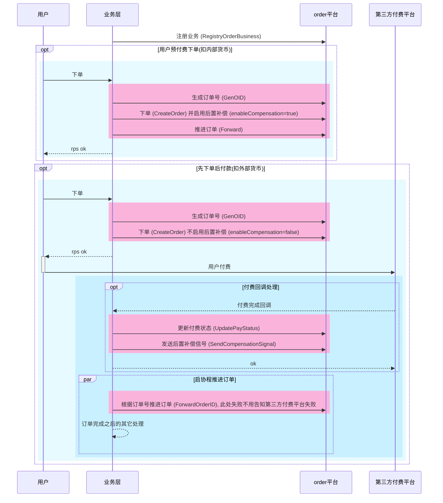
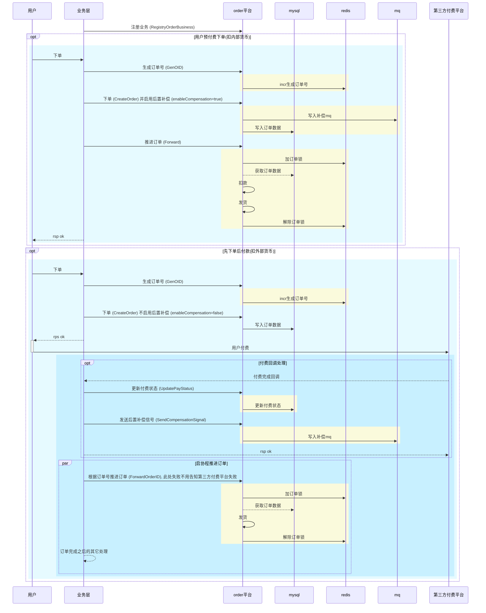

<!-- TOC -->

- [什么是 order](#%E4%BB%80%E4%B9%88%E6%98%AF-order)
- [前置准备](#%E5%89%8D%E7%BD%AE%E5%87%86%E5%A4%87)
    - [mysql](#mysql)
- [开始](#%E5%BC%80%E5%A7%8B)
- [底层设计](#%E5%BA%95%E5%B1%82%E8%AE%BE%E8%AE%A1)
    - [订单从创建到付款到发货基础流程, 使用者只开发关注业务层代码下图粉色部分](#%E8%AE%A2%E5%8D%95%E4%BB%8E%E5%88%9B%E5%BB%BA%E5%88%B0%E4%BB%98%E6%AC%BE%E5%88%B0%E5%8F%91%E8%B4%A7%E5%9F%BA%E7%A1%80%E6%B5%81%E7%A8%8B-%E4%BD%BF%E7%94%A8%E8%80%85%E5%8F%AA%E5%BC%80%E5%8F%91%E5%85%B3%E6%B3%A8%E4%B8%9A%E5%8A%A1%E5%B1%82%E4%BB%A3%E7%A0%81%E4%B8%8B%E5%9B%BE%E7%B2%89%E8%89%B2%E9%83%A8%E5%88%86)
    - [完整的流程如下, 黄色部分表示order平台工作](#%E5%AE%8C%E6%95%B4%E7%9A%84%E6%B5%81%E7%A8%8B%E5%A6%82%E4%B8%8B-%E9%BB%84%E8%89%B2%E9%83%A8%E5%88%86%E8%A1%A8%E7%A4%BAorder%E5%B9%B3%E5%8F%B0%E5%B7%A5%E4%BD%9C)
- [配置文件](#%E9%85%8D%E7%BD%AE%E6%96%87%E4%BB%B6)

<!-- /TOC -->

---

# 什么是 order

order 是一个订单系统, 可用于任何基于订单的业务, 比如商品购买/发货等.
这个库是实现订单系统的lib库, 多个不同业务/分布式系统也能直接引用这个lib库且可以使用相同的底层储存组件(redis/mysql), 其业务隔离性由订单类型来区分.

- [x] 多订单类型
- [x] 多支付类型
- [ ] 混合支付
- [x] 预付款下单(扣内部货币)
- [x] 先下单后付款(扣外部货币)


- [x] 业务数据嵌入到订单


- [ ] 订单变动流水记录


- [x] 并发支持
- [x] 订单可重入


- [ ] metrics上报

---

# 前置准备

## mysql

1. 首先准备一个库名为 `order` 的mysql库. 这个库名可以根据sqlx组件配置的连接db库修改
2. 创建订单的分表, 默认为2个分表, 分表索引从0开始, 可以通过配置`TableShardNums`修改. 一开始应该设计好分表数量, 确认好后暂不支持修改分表数量, 如果你不知道设置为多少就设为1000.
   1. 构建分表的工具为 [stf](https://github.com/zlyuancn/stt/tree/master/stf)
   2. 订单系统的分表文件在[这里](https://github.com/zlyuancn/order/tree/master/db_table/order_.sql)
   3. 在[这里](https://github.com/zlyuancn/order/tree/master/db_table/order_.out.sql)可以看到已经生成好了2个分表的sql文件, 可以直接导入.

---

# 开始

```go
app := zapp.NewApp("zapp.test.order",
    order.WithService(),
)
defer app.Exit()
```

---

# 底层设计

## 订单从创建到付款到发货基础流程, 使用者只开发关注业务层代码(下图粉色部分)



## 完整的流程如下, 黄色部分表示order平台工作



---

# 配置文件

详细实现转到[conf/config.go](./conf/config.go)

```yaml
# order配置
order:
   SqlxName: "order" # sqlx组件名
   TableShardNums: 2 # 表分片数量

   RedisName: "order" # redis组件名
   OrderLockDBExpire: 30 # 订单锁有效时间, 单位秒
   OrderUnlockDBLimitProcessTime: 10 # 订单处理在多少时间内完成才会主动解锁, 单位秒
   OrderLockKeyFormat: 'order:lock:op:<order_id>' # 订单锁key格式化字符串
   OrderSeqNoKeyFormat: 'order:seqno:<order_type>:<shard_num>' # 生成订单序列号key格式化字符串

   MQType: "pulsar" # mq类型. 支持 pulsar
   MQProducerName: "order" # mq生产者组件名
   AllowMqCompensation: false # 是否允许mq补偿, 如果为false, 将不会启动mq补偿消费进程, 代码中的提交mq补偿会报错, 且不会启动mq补偿消费者
   CompensationDelayTime: 60 # mq补偿延迟时间, 单位秒
   MQConsumeName: "order" # mq消费者组件名
   CompensationMQMsgLifeTime: 3600 # mq消息如果存活超过这个时间, 在失败后不会再重试了. 单位秒

# 依赖组件
components:
  sqlx: # 参考 https://github.com/zly-app/component/tree/master/sqlx
    score:
      # ...
  redis: # 参考 https://github.com/zly-app/component/tree/master/redis
    score:
      # ...
  pulsar-producer: # 参考 https://github.com/zly-app/component/tree/master/pulsar-producer
    order:
      # ...

# 依赖服务
services:
  pulsar-consume: # 参考 https://github.com/zly-app/service/tree/master/pulsar-consume
    order:
      # ...
```

在 apollo 中, 对于 `order` 配置可以直接创建一个 `order` 命名空间

```yaml
SqlxName: "order" # sqlx组件名
TableShardNums: 2 # 表分片数量
RedisName: "order" # redis组件名
OrderLockDBExpire: 30 # 订单锁有效时间, 单位秒
OrderUnlockDBLimitProcessTime: 10 # 订单处理在多少时间内完成才会主动解锁, 单位秒
MQType: "pulsar" # mq类型. 支持 pulsar
MQProducerName: "order" # mq生产者名
AllowMqCompensation: false # 是否允许mq补偿, 如果为false, 将不会启动mq补偿消费进程, 代码中的提交mq补偿会报错, 且不会启动mq补偿消费者
CompensationDelayTime: 60 # mq补偿延迟时间, 单位秒
MQConsumeName: "order" # mq消费者名
CompensationMQMsgLifeTime: 3600 # mq消息如果存活超过这个时间, 在失败后不会再重试了. 单位秒
```
