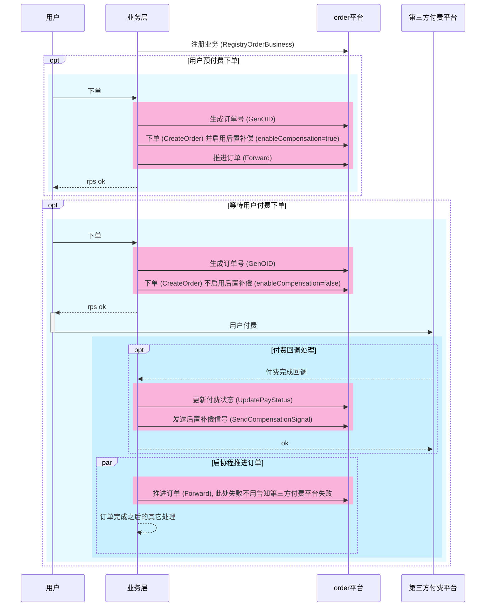
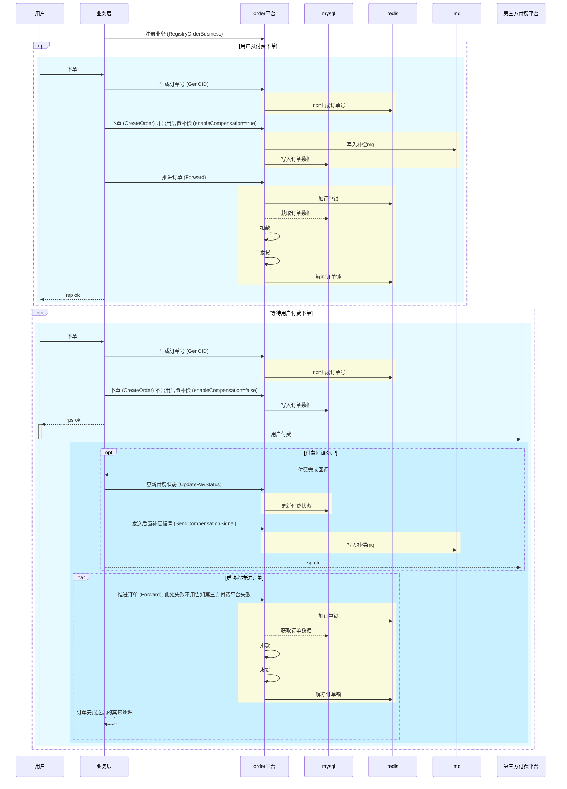

# 前置准备

## mysql

1. 首先准备一个库名为 `order` 的mysql库. 这个库名可以通过配置`DBName`修改
2. 创建订单的分表, 默认为2个分表, 分表索引从0开始, 可以通过配置`TableShardNums`修改.
   1. 构建分表的工具为 [stf](https://github.com/zlyuancn/stt/tree/master/stf)
   2. 订单系统的分表文件在[这里](https://github.com/zlyuancn/order/tree/master/db_table/order_.sql)
   3. 在[这里](https://github.com/zlyuancn/order/tree/master/db_table/order_.out.sql)可以看到已经生成好了2个分表的sql文件, 可以直接导入.

# 订单从创建到付款到发货基础流程, 使用者只开发关注业务层代码(下图粉色部分)

## 完整的流程如下, 黄色部分表示order平台工作

